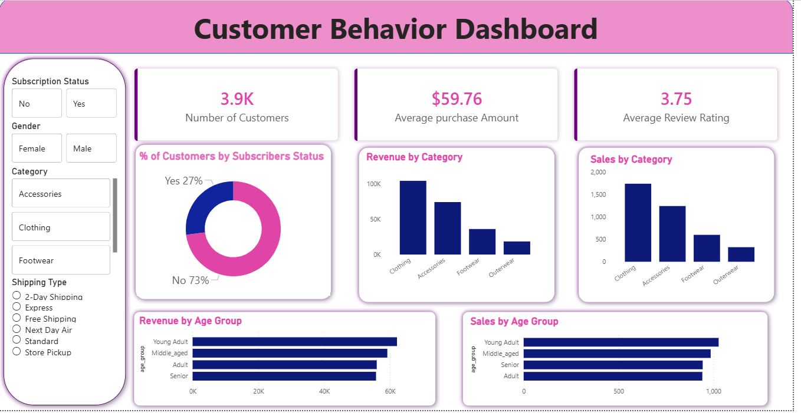

- Customer Shopping Behavior Analysis

## Project Overview
This project analyzes customer shopping behavior using Python, SQL, and Power BI. The goal is to understand customer purchase patterns, product preferences, subscription status, discount usage, and revenue performance.

## Dataset
- Total Records: 3,900
- Total Features: 18
- File: customer_shopping_behavior.csv

## Tools Used
- Python
- Pandas
- SQL
- Power BI
- Jupyter Notebook

## Project Files
- customer_shopping_behavior.csv - Dataset
- Customer_Shopping_Behavior_Analysis.ipynb - Python analysis notebook
- Customer_Shopping_Behavior_Dashboard.pbix - Power BI dashboard file
- PowerBI_Dashboard_Screenshot.png - Dashboard screenshot
- Customer Shopping Behavior Analysis.pdf - Project report

## Key Insights
- Clothing category generated high sales and revenue.
- Most customers are non-subscribers.
- Average purchase amount is around $59.76.
- Average review rating is around 3.75.
- Young adult and middle-aged customers contribute strongly to revenue.

## Dashboard Preview

## Business Recommendations
- Promote subscription benefits to increase subscriber count.
- Give loyalty rewards to repeat customers.
- Focus marketing on high-revenue age groups.
- Promote top-selling product categories.
- Review discount strategy to balance sales and profit.

## Conclusion
This project shows how data analytics can help understand customer behavior and support better business decisions in retail and e-commerce.
